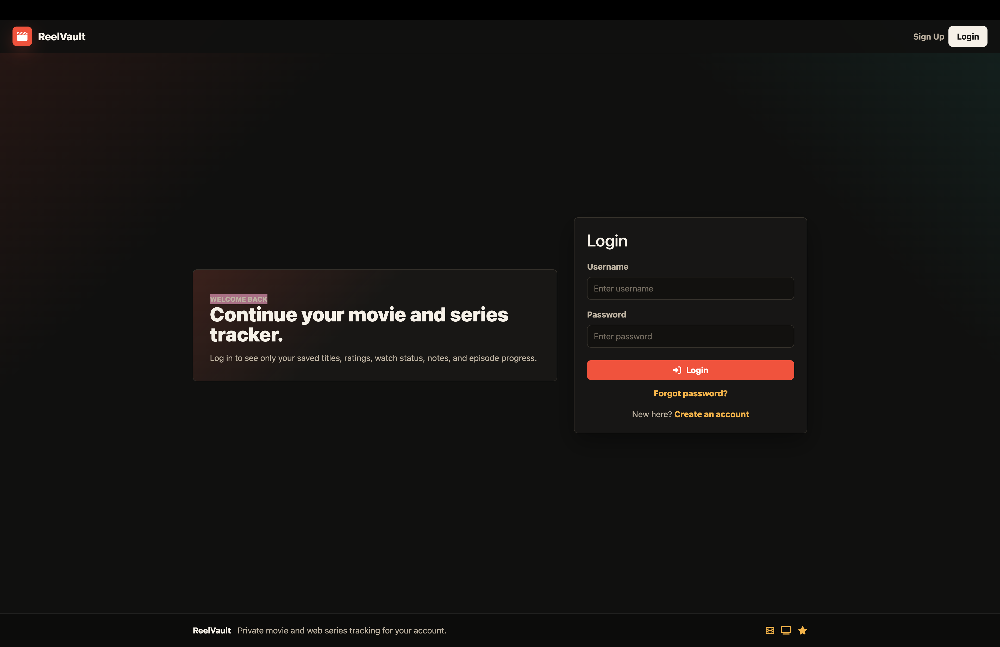
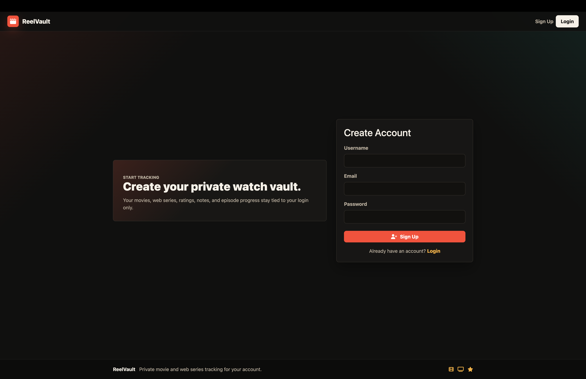
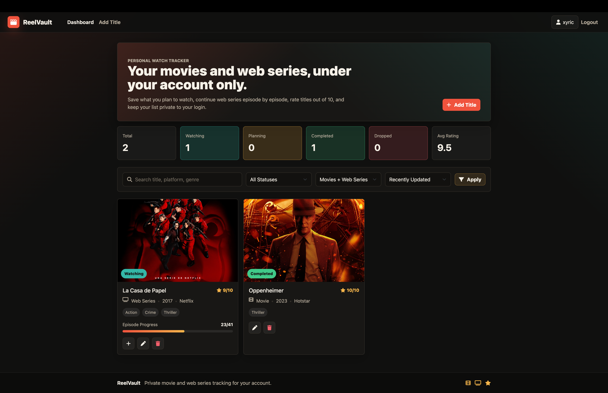
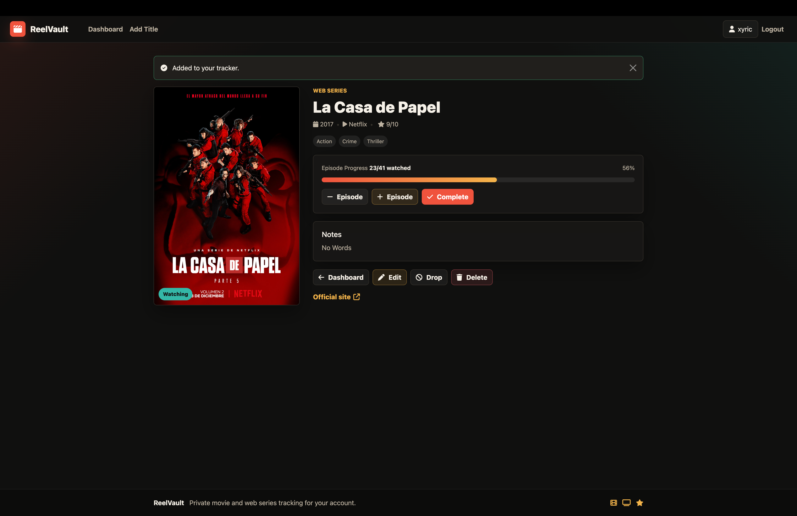
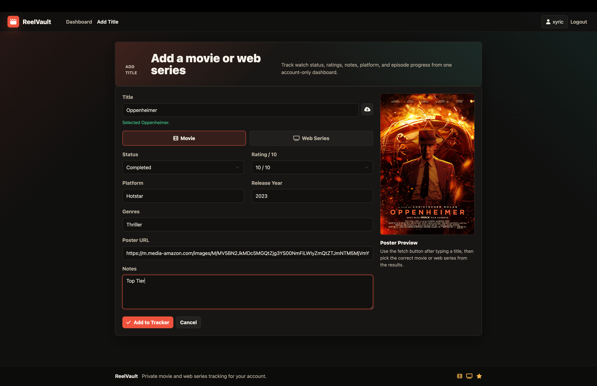

# ReelVault

A full-stack web application for tracking movies, TV series, and anime in one place.

🌐 **Live Demo:**  
https://reelvault-skgc.onrender.com/login

---

## Features

### Authentication
- Sign Up
- Login
- Logout
- Secure session-based authentication using Passport.js

### Personal Watch Tracker
- Add movies and web series
- Edit existing entries
- Delete entries
- Track watch status
- Rate titles
- Store personal notes
- Track episode progress for web series

### Dashboard
- View all saved titles
- Statistics overview
- Search and filtering options
- Personal watchlist management

### Database & Security
- MongoDB Atlas cloud database
- User-specific data isolation
- Session management
- Flash messages for user feedback

---

## Screenshots

### Login Page


### Sign Up Page


### Dashboard


### Add Movie / Web Series


### Title Details & Progress Tracking


---

## Tech Stack

### Frontend
- HTML
- CSS
- JavaScript
- EJS
- Bootstrap

### Backend
- Node.js
- Express.js

### Database
- MongoDB Atlas
- Mongoose

### Authentication
- Passport.js
- Passport Local
- Passport Local Mongoose

### Deployment
- Render
- MongoDB Atlas

---

## Installation

Clone the repository:

```bash
git clone https://github.com/ayannshh/ReelVault.git
cd ReelVault
npm install
```

Create a `.env` file:

```env
MONGO_URL=your_mongodb_connection_string
SESSION_SECRET=your_secret_key
```

Run the application:

```bash
node app.js
```

Visit:

```text
http://localhost:8000
```

---

## Project Structure

```text
ReelVault
├── models
├── routes
├── views
├── public
├── utils
├── app.js
└── package.json
```

---

## Live Demo

https://reelvault-skgc.onrender.com/login

---

## Future Improvements

- Advanced search functionality
- Genre filtering
- Sorting options
- Watch history analytics
- User profile page
- Password reset via email
- Dark/Light theme toggle
- Mobile app version

---

## Author

**Aayansh Tarafdar**

GitHub: https://github.com/ayannshh

LinkedIn: https://www.linkedin.com/in/aayansh-tarafdar/

---

## License

This project is licensed under the MIT License.
